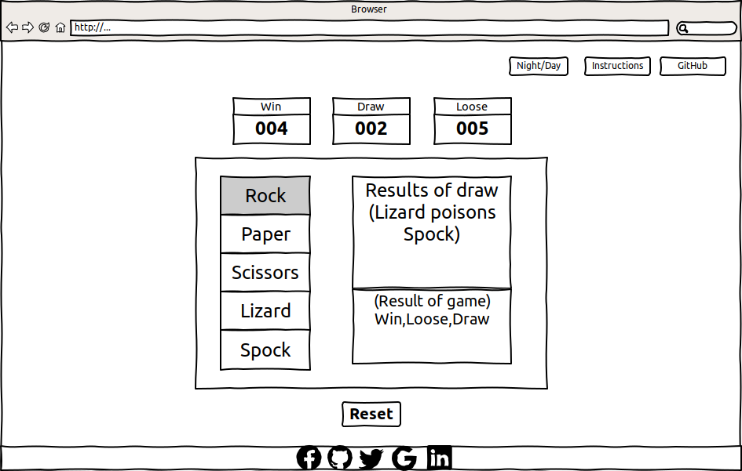

<h1>Rock Paper Scissors Lizard Spock</h1>

<h2>Interactive Frontend Development Milestone Project Two</h2>

My second Milestone Project will be an Interactive rock, paper, scissors, Lizard, Spock game inspired by the game played on <a href="https://bigbangtheory.fandom.com/wiki/Rock,_Paper,_Scissors,_Lizard,_Spock" rel="nofollow">The Big Bang Theory</a>.

<h2>User Experience (UX)</h2>

This website is designed to be an interactive Rock Paper Scissors game with the addition of Lizard and Spock, where the user plays against the computer and can track their scores.

<h2>User Stories</h2>

<h3>User Story 1</h3>

As a user I want to play Rock Paper Scissors.

<h3>Acceptance Criteria</h3>

<ul>
    <li>The user should be able to select Rock, Paper or Scissors.</li>
    <li>The user should be able to see the outcome of their selection.</li>
    <li>The user should be able to see the outcome of the computers selection.</li>
    <li>The user should be able to reset the game by pressing the reset button and starting a new game.</li>
</ul>

<h3>Description:</h3>

once the user picks rock paper or scissors the large text area to the right will show what the user picked and what the computer picked.

The smaller text area will show if the user wins, loses or draws. This text area will also change colour green for a win, red for a loss and amber for a draw.

Pressing the reset button will reset the scoreboard and start a new game.

<h3>User Story 2</h3>

As a user I want to know how to play the game.

<h3>Acceptance Criteria</h3>

<ul>
    <li>The instructions should be clear and easy to understand.</li>
    <li>The instructions should be available through the instructions button.</li>
    <li>Instructions should be accessible at any time.</li>
    <li>All interactive parts of the website should be clearly labeled.</li>
</ul>

<h3>Description:</h3>

To see the instructions at any point press the button labeled instructions and a pop will appear showing the instructions.

<h3>User Story 3</h3>

As a user I want to know what my score is.

<h3>Acceptance Criteria</h3>

<ul>
    <li>As the user selects rock, paper or scissors the larger text area will show what they have picked.</li>
    <li>Once the user has made a selection the same text area will show what the computer picked.</li>
    <li>The smaller text area below will show the results of the current game. Win, Lose or Draw.</li>
    <li>The smaller text area will change colour depending on the results. Green for win, amber for draw and red for a lose.</li>
    <li>The Win, Draw or Lose score boards above adjust to show the current scores.</li>
</ul>

<h3>Description:</h3>

The three score boards near the top will keep track of the pervious scores and will be updated as the game is played.

<h3>User Story 4</h3>

As a user I may wish to play the game with a light theme or a light theme.

<h3>Acceptance Criteria</h3>

<ul>
    <li>The Night/Day switch should be easily identified.</li>
    <li>Switching the Night/Day switch should seamlessly switch the theme for the whole site.</li>
    <li>Instructions on the Night/Day switch should be in the pop up instructions along with how to play the game.</li>
    <li>Switching themes should not affect things like the scores or how the game is played.</li>
</ul>

<h3>Description:</h3>

Selecting the Night/Day switch will allow the user to change themes from a light theme, if they are playing in the daytime, or a dark theme if they are playing the knight time.

<h3>User Story 5</h3>

As a user I may wish to find out more about the person who made the game and any other projects they may be working on.

<h3>Acceptance Criteria</h3>

<ul>
    <li>The GitHub button will open a new window taking the user to the games GitHub project page.</li>
    <li>The social media bar at the bottom will take the user to the authors various social media pages.</li>
    <li>Clicking on a social media link will open a new window so as to not lose or reset the score of the current game.</li>
</ul>

<h3>Description:</h3>

The user may wish to know more about the current project, how it was developed, what technologies used, where the developer found needed to develope the game and any problems the developer had during development

The user may also wish to contact or follow the developer on one or many of his social media platform's.

<h2>Technologies</h2>

The Technologies used in this project are listed bellow.

<ul>
    <li>
        <a href="https://getbootstrap.com/" rel="nofollow">Bootstrap 4</a>
    </li>
    <li>
        <a href="https://en.wikipedia.org/wiki/HTML5" rel="nofollow">HTML5</a>
    </li>
    <li>
        <a href="https://en.wikipedia.org/wiki/CSS" rel="nofollow">CSS3</a>
    <li>
        <a href="https://fontawesome.com/" rel="nofollow">Font Awesome</a>
    </li>
        <li>
        <a href="https://fonts.google.com/" rel="nofollow">Google Fonts</a>
    </li>
    <li>
        <a href="https://github.com/" rel="nofollow">GitHub for version control</a>
    </li>
    <li>
        <a href="https://gitpod.io/" rel="nofollow">Gitpod</a>
    </li>
    <li>
        <a href="https://wireframesketcher.com/" rel="nofollow">Wireframesketcher</a>
    </li>
    <li>
        <a href="https://sweetalert2.github.io/" rel="nofollow">sweetalert2</a>
    </li>
    <li>
        <a href="https://www.libreoffice.org/" rel="nofollow"><b>Libre</b>office</a>
    </li>
</ul>

<h2>Design</h2>

Inspiration for the game came from <a href="https://bigbangtheory.fandom.com/wiki/Main_Page" rel="nofollow">The Big Bang Theory</a>. In the episode <a href="https://bigbangtheory.fandom.com/wiki/The_Lizard-Spock_Expansion" rel="nofollow">The Lizard-Spock Expansion</a> Sheldon, Raj and Leonard are arguing about what to watch on TV, Raj suggests rock, paper, scissors. Sheldon says there is too much chance of a tie, and suggests Rock Paper Scissors Lizard Spock.

<h2>Wireframes</h2>

The Wireframes were created using <a href="https://wireframesketcher.com/" rel="nofollow">wireframesketcher</a> a powerful desktop wire framing tool.

<h3>Desktop</h3>
<a href="assets/wireframe/Desktop.pdf" rel="nofollow">PDF Link</a>

<h3>Desktop with annotation's</h3>
<a href="assets/wireframe/Desktop-instructions.pdf" rel="nofollow">PDF Link</a>

<h3>Mobile view</h3>
<a href="assets/wireframe/Mobile.pdf" rel="nofollow">PDF Link</a>

The final results may differ slightly from the wireframes.

<h2>Logic flow diagram</h2>

The following Logic flow diagrams show the steps taken to test each of the conditions that would give either a win, lose or draw result.

<h3>User picks Rock.</h3>
<a href="assets/wireframe/User picks Rock.pdf" rel="nofollow">PDF Link</a>

<h3>User picks Paper.</h3>
<a href="assets/wireframe/User picks Paper.pdf" rel="nofollow">PDF Link</a>

<h3>User picks Scissors.</h3>
<a href="assets/wireframe/User picks Scissors.pdf" rel="nofollow">PDF Link</a>

<h3>User picks Lizard.</h3>
<a href="assets/wireframe/User picks Lizard.pdf" rel="nofollow">PDF Link</a>

<h3>User picks Spock.</h3>
<a href="assets/wireframe/User picks Spock.pdf" rel="nofollow">PDF Link</a>

<h2>Feature</h2>

<h2>Testing</h2>

For testing documentation please refer to the <a href="Testing.md" rel="nofollow">Testing markdown</a>

<h2>Deployment</h2>

<h3>GitHub Pages</h3>

The project was deployed to GitHub Pages using the following steps...

<ol>
    <li>Log in to GitHub and locate the <a href="https://github.com/Darian-Frey/Milestone-Project-Two" rel="nofollow">GitHub Repository</a></li>
    <li>At the top of the Repository (not top of page), locate the "Settings" Button on the menu. 
        - Alternatively Click <a href="https://raw.githubusercontent.com/" rel="nofollow">Here</a> for a GIF demonstrating the process starting from Step 2.</li>
    <li>Scroll down the Settings page until you locate the "GitHub Pages" Section.</li>
    <li>Under "Source", click the dropdown called "None" and select "Master Branch".</li>
    <li>The page will automatically refresh.</li>
    <li>Scroll back down through the page to locate the now published site <a href="https://github.com" rel="nofollow">Link</a> in the "GitHub Pages" section.</li>
</ol>

<h3>Forking the GitHub Repository</h3>

By forking the GitHub Repository you make a copy of the original repository on your GitHub account to view and/or make changes without affecting the original repository by using the following steps...

<ol>
    <li>Log in to GitHub and locate the 1. Log in to GitHub and locate the <a href="https://github.com/Darian-Frey/Milestone-Project-Two" rel="nofollow">GitHub Repository</a></li>
    <li>At the top of the Repository (not top of page) just above the "Settings" Button on the menu, locate the "Fork" Button.</li>
    <li>You should now have a copy of the original repository in your GitHub account.</li>
</ol> 

<h3>Making a Local Clone</h3>

<ol>
    <li>Log in to GitHub and locate the <a href="https://github.com/Darian-Frey/Milestone-Project-Two" rel="nofollow">GitHub Repository</a></li>
    <li>Under the repository name, click "Clone or download".</li>
    <li>To clone the repository using HTTPS, under "Clone with HTTPS", copy the link.</li>
    <li>Open Git Bash</li>
    <li>Change the current working directory to the location where you want the cloned directory to be made.<li/>
    Type <code>git clone</code>, and then paste the URL you copied in Step 3. 
    <code>$ git clone https://github.com/YOUR-USERNAME/YOUR-REPOSITORY</code></li>
    <li>Press Enter. Your local clone will be created. 
    <code>$ git clone https://github.com/YOUR-USERNAME/YOUR-REPOSITORY 
    > Cloning into `CI-Clone`... 
    > remote: Counting objects: 10, done. 
    > remote: Compressing objects: 100% (8/8), done. 
    > remove: Total 10 (delta 1), reused 10 (delta 1) 
    > Unpacking objects: 100% (10/10), done.</code></li>
</ol>

Click <a href="https://help.github.com/en/github/creating-cloning-and-archiving-repositories/cloning-a-repository#cloning-a-repository-to-github-desktop" rel="nofollow">Here</a> to retrieve pictures for some of the buttons and more detailed explanations of the above process.

<h2>Credits & Acknowledgements</h2>

I would like to thank the following.

<ul>
    <li>Excellence Ilesanmi for his support and advice through this project.</li>
    <li><a href="https://courses.codeinstitute.net/">Code Institute</a> for this excellent course.</li>
    <li><a href="https://getbootstrap.com/">Bootstrap</a>, <a href="https://www.w3schools.com/">W3Schools</a>, <a href="https://www.freecodecamp.org/">freecodecamp</a> and <a href="https://css-tricks.com/">css-tricks</a> for all the example code.</li>
    <li><a href="https://coolors.co/">Coolors</a> for the colours and theme ideas.</li>
    <li><a href="https://sweetalert2.github.io/">Sweet alert 2</a> for the instructions popup.</li>
    <li>Pete R. at <a href="https://onextrapixel.com/creating-hal-9000-with-pure-css/">onextrapixel</a> for the HAL9000 logo.</li>
    <li><a href="https://bigbangtheory.fandom.com/wiki/Rock,_Paper,_Scissors,_Lizard,_Spock">The Big Bang Theory</a> where the inspiration for the game came from.</li>
    <li>And my partner for her near infinite tolerance of me obsessing over my code.</li>
</ul>