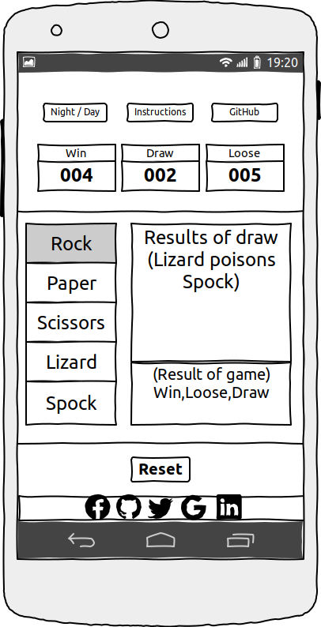

<h1>Rock Paper Scissors</h1>

<h2>Interactive Frontend Development Milestone Project Two</h2>

My second Milestone Project will be an Interactive rock, paper, scissors game powered by Javascript.

<h2>User Experience (UX)</h2>

This website is designed to be an interactive Rock Paper Scissors game, where the user plays against the computer and can track their scores.

<h2>User Stories</h2>

<h3>User Story 1</h3>

As a user I want to play Rock Paper Scissors.

<h3>Acceptance Criteria</h3>

<ul>
    <li>The user should be able to select Rock, Paper or Scissors.</li>
    <li>The user should be able to see the outcome of their selection.</li>
    <li>The user should be able to see the outcome of the computers selection.</li>
    <li>The user should be able to reset the game by pressing the reset button and starting a new game.</li>
</ul>

<h3>Description:</h3>

once the user picks rock paper or scissors the large text area to the right will show what the user picked and what the computer picked.

The smaller text area will show if the user wins, loses or draws. This text area will also change colour green for a win, red for a loss and amber for a draw.

Pressing the reset button will reset the scoreboard and start a new game.

<h3>User Story 2</h3>

As a user I want to know how to play the game.

<h3>Acceptance Criteria</h3>

<ul>
    <li>The instructions should be clear and easy to understand.</li>
    <li>The instructions should be available through the instructions button.</li>
    <li>Instructions should be accessible at any time.</li>
    <li>All interactive parts of the website should be clearly labeled.</li>
</ul>

<h3>Description:</h3>

To see the instructions at any point press the button labeled instructions and a pop will appear showing the instructions.

<h3>User Story 3</h3>

As a user I want to know what my score is.

<h3>Acceptance Criteria</h3>

<ul>
    <li>As the user selects rock, paper or scissors the larger text area will show what they have picked.</li>
    <li>Once the user has made a selection the same text area will show what the computer picked.</li>
    <li>The smaller text area below will show the results of the current game. Win, Lose or Draw.</li>
    <li>The smaller text area will change colour depending on the results. Green for win, amber for draw and red for a lose.</li>
    <li>The Win, Draw or Lose score boards above adjust to show the current scores.</li>
</ul>

<h3>Description:</h3>

The three score boards near the top will keep track of the pervious scores and will be updated as the game is played.

<h3>User Story 4</h3>

As a user I may wish to play the game with a light theme or a light theme.

<h3>Acceptance Criteria</h3>

<ul>
    <li>The Night/Day switch should be easily identified.</li>
    <li>Switching the Night/Day switch should seamlessly switch the theme for the whole site.</li>
    <li>Instructions on the Night/Day switch should be in the pop up instructions along with how to play the game.</li>
    <li>Switching themes should not affect things like the scores or how the game is played.</li>
</ul>

<h3>Description:</h3>

Selecting the Night/Day switch will allow the user to change themes from a light theme, if they are playing in the daytime, or a dark theme if they are playing the knight time.

<h3>User Story 5</h3>

As a user I may wish to find out more about the person who made the game and any other projects they may be working on.

<h3>Acceptance Criteria</h3>

<ul>
    <li>The GitHub button will open a new window taking the user to the games GitHub project page.</li>
    <li>The social media bar at the bottom will take the user to the authors various social media pages.</li>
    <li>Clicking on a social media link will open a new window so as to not lose or reset the score of the current game.</li>
</ul>

<h3>Description:</h3>

The user may wish to know more about the current project, how it was developed, what technologies used, where the developer found needed to develope the game and any problems the developer had during development

The user may also wish to contact or follow the developer on one or many of his social media platform's.

<h2>Technologies</h2>

The Technologies used in this project are listed bellow.

<ul>
    <li>
        <a href="https://getbootstrap.com/" rel="nofollow">Bootstrap 4</a>
    </li>
    <li>
        <a href="https://en.wikipedia.org/wiki/HTML5" rel="nofollow">HTML5</a>
    </li>
    <li>
        <a href="https://en.wikipedia.org/wiki/CSS" rel="nofollow">CSS3</a>
    <li>
        <a href="https://fontawesome.com/" rel="nofollow">Font Awesome</a>
    </li>
        <li>
        <a href="https://fonts.google.com/" rel="nofollow">Google Fonts</a>
    </li>
    <li>
        <a href="https://github.com/" rel="nofollow">GitHub for version control</a>
    </li>
    <li>
        <a href="https://gitpod.io/" rel="nofollow">Gitpod</a>
    </li>
    <li>
        <a href="https://wireframesketcher.com/" rel="nofollow">Wireframesketcher</a>
    </li>
    <li>
        <a href="https://sweetalert2.github.io/" rel="nofollow">sweetalert2</a>
    </li>
</ul>

<h2>Design</h2>

Inspiration for the game came from <a href="https://bigbangtheory.fandom.com/wiki/Main_Page" rel="nofollow">The Big Bang Theory</a>. In the episode <a href="https://bigbangtheory.fandom.com/wiki/The_Lizard-Spock_Expansion" rel="nofollow">The Lizard-Spock Expansion</a> Sheldon, Raj and Leonard are arguing about what to watch on TV, Raj suggests rock, paper, scissors. Sheldon says there is too much chance of a tie, and suggests Rock Paper Scissors Lizard Spock.

<h2>Wireframes</h2>

The Wireframes were created using <a href="https://wireframesketcher.com/" rel="nofollow">wireframesketcher</a> a powerful desktop wire framing tool.

<h3>Desktop</h3>
<a href="assets/wireframe/Desktop.pdf" rel="nofollow">PDF Link</a>

<h3>Desktop with annotation's</h3>
<a href="assets/wireframe/Desktop-instructions.pdf" rel="nofollow">PDF Link</a>

<h3>Mobile view</h3>
<a href="assets/wireframe/Mobile.pdf" rel="nofollow">PDF Link</a>

<h2>Logic flow diagram</h2>

The following Logic flow diagrams show the steps taken to test each of the conditions that would give either a win, lose or draw result.

<h2>Feature</h2>

<h2>Testing</h2>

[Testing](Testing.md)

<h2>Deployment</h2>

<h2>Credits</h2>

https://www.w3schools.com/

https://www.freecodecamp.org/

The game
https://bigbangtheory.fandom.com/wiki/Rock,_Paper,_Scissors,_Lizard,_Spock

https://css-tricks.com/

https://coolors.co/

https://sweetalert2.github.io/